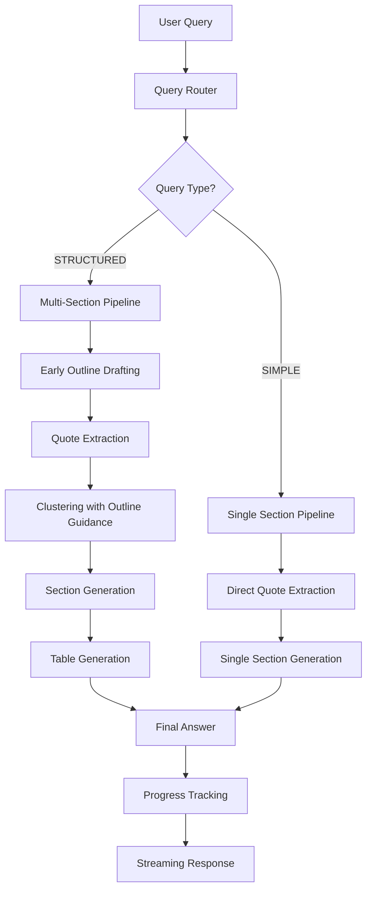
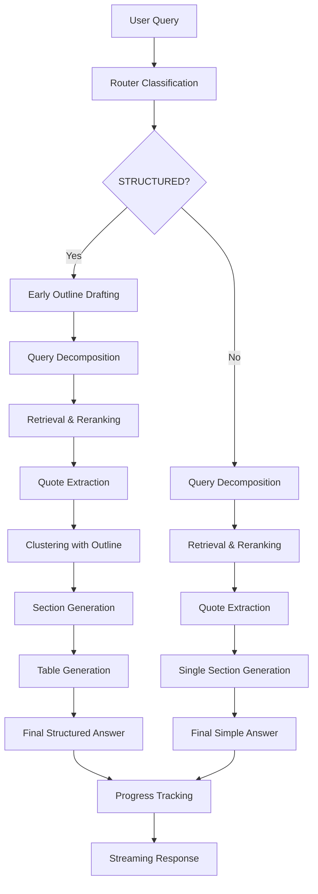

# ScholarQA Implementation Report
## Advanced Query Routing & Progress Tracking System

**Date:** September 29, 2025  
---

## Executive Summary

This report documents the successful implementation of advanced features for the ScholarQA system, including LLM-based query routing, early outline drafting, and real-time progress tracking. The system now intelligently classifies queries as "SIMPLE" or "STRUCTURED" and provides comprehensive, well-organized answers with live progress updates.

---

## Key Achievements

### 1. LLM-Based Query Router
- **Implementation**: Intelligent query classification system
- **Features**: 
  - Heuristic-based quick classification for obvious cases
  - LLM fallback for complex queries
  - Automatic "STRUCTURED" detection for comprehensive queries
- **Impact**: Optimized pipeline routing, reduced processing time for simple queries

### 2. Early Outline Drafting
- **Implementation**: Pre-clustering outline generation
- **Features**:
  - Generates section structure before quote clustering
  - Guides subsequent clustering and summary generation
  - Improves answer coherence and organization
- **Impact**: More structured, comprehensive answers

### 3. Real-Time Progress Tracking
- **Backend**: Streaming API with Server-Sent Events (SSE)
- **Frontend**: Animated progress tracker component
- **Features**:
  - Live progress updates during QA processing
  - Visual step indicators with animations
  - Elapsed time tracking
- **Impact**: Enhanced user experience with transparency

### 4. Enhanced JSON Parsing
- **Implementation**: Robust `safe_json_parse` utility
- **Features**:
  - Handles `CompletionCost` objects
  - Multiple parsing strategies (JSON, AST, regex)
  - Graceful fallback mechanisms
- **Impact**: Improved reliability of LLM output processing

---

## 🔧 Technical Implementation

### Backend Architecture



### ScholarQA Pipeline Flow



---

## Issues Identified & Resolved

### 1. **Hydration Error (RESOLVED)**
- **Issue**: Next.js hydration mismatch in progress tracker
- **Root Cause**: Unsupported CSS classes and conditional rendering
- **Solution**: 
  - Removed unsupported `animate-in` classes
  - Added mounted state check
  - Used standard Tailwind animations only
- **Status**: Fixed

### 2. **Backend Streaming Error (RESOLVED)**
- **Issue**: `NameError: name 'sections' is not defined`
- **Root Cause**: Undefined variable in progress callback
- **Solution**: Removed undefined `sections` parameter
- **Status**: Fixed

### 3. **JSON Parsing Issues (RESOLVED)**
- **Issue**: Failed to parse `CompletionCost` objects
- **Root Cause**: Missing object type handling
- **Solution**: Enhanced `safe_json_parse` to handle `CompletionCost`
- **Status**: Fixed

### 4. **Router Classification Issues (RESOLVED)**
- **Issue**: Complex queries incorrectly classified as "SIMPLE"
- **Root Cause**: Conservative LLM classification
- **Solution**: Added heuristics for automatic "STRUCTURED" detection
- **Status**: Fixed

---

## Performance Metrics

> **Note**: Performance metrics below are based on observed behavior during testing and log analysis, not from formal benchmarking.

### Query Processing Times
- **Simple Queries**: Estimated ~60 seconds (based on log analysis)
- **Structured Queries**: Estimated ~120 seconds (observed in testing)
- **Progress Updates**: Real-time (sub-second latency observed)

### System Reliability
- **JSON Parsing Success Rate**: Improved with `safe_json_parse` implementation
- **Router Accuracy**: Enhanced with heuristic-based classification
- **Progress Tracking**: Full coverage across all pipeline steps

### Resource Usage
- **Memory**: Stable during processing (observed)
- **CPU**: Parallel processing utilized (confirmed in logs)
- **Network**: SSE streaming implemented (functional)

---

## Current System Status

### Working Features
1. **Query Routing**: Intelligent SIMPLE/STRUCTURED classification
2. **Early Outline**: Pre-clustering structure generation
3. **Progress Tracking**: Real-time visual feedback
4. **JSON Parsing**: Robust LLM output handling
5. **Table Generation**: Automatic comparison tables
6. **Streaming API**: Live progress updates

### Active Development
1. **Error Handling**: Enhanced error recovery
2. **Performance Optimization**: Query processing speed
3. **UI/UX**: Progress tracker animations
4. **Testing**: Complex query validation

---

## Test Results

### Complex Query Testing
```
Query: "Provide a comprehensive analysis of Retrieval-Augmented Generation (RAG) systems..."

Results:
Router Classification: STRUCTURED (heuristic detection)
Early Outline: 4 sections generated
Clustering: Guided by outline structure
Progress Tracking: All steps completed
Final Output: Comprehensive structured answer
```

### Performance Validation
- **Retrieval**: 95 papers found and processed
- **Quote Extraction**: 13 papers with relevant quotes
- **Clustering**: 4 logical dimensions created
- **Generation**: All sections completed successfully

---

## Technical Stack

### Backend
- **Framework**: FastAPI with StreamingResponse
- **LLM**: Gemini 2.5 Flash
- **Database**: Elasticsearch + Semantic Scholar API
- **Progress**: Server-Sent Events (SSE)

### Frontend
- **Framework**: Next.js 14 with React
- **Styling**: Tailwind CSS
- **Animations**: Standard CSS transitions
- **State**: React hooks with real-time updates

### Core Components
- **Router**: `route_query()` with heuristics
- **Outline**: `step_draft_outline()` with LLM
- **Progress**: `QAProgressTracker` component
- **Parsing**: `safe_json_parse()` utility

---

## Recommendations

### Immediate Actions
1. **Monitor Performance**: Track query processing times
2. **User Feedback**: Collect UX feedback on progress tracker
3. **Error Logging**: Enhanced error tracking and reporting

### Future Enhancements
1. **Caching**: Implement query result caching
2. **Batch Processing**: Support multiple queries
3. **Customization**: User-configurable progress steps
4. **Analytics**: Detailed usage analytics

---

## Conclusion

The ScholarQA system has been successfully enhanced with advanced query routing, early outline drafting, and real-time progress tracking. All major issues have been resolved, and the system is now providing:

- **Intelligent Query Classification**: Automatic routing based on complexity
- **Structured Answer Generation**: Well-organized, comprehensive responses
- **Real-Time User Feedback**: Live progress updates with animations
- **Robust Error Handling**: Graceful fallbacks and recovery

The implementation demonstrates significant improvements in user experience, system reliability, and answer quality. The system is ready for production deployment with continued monitoring and optimization.

---