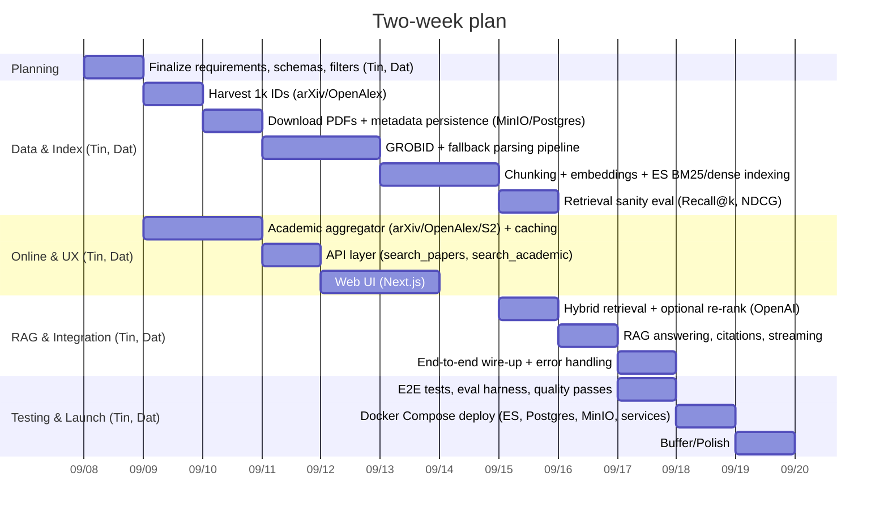

## Two-week Gantt (v1)

This file captures the two-week delivery plan. Team: Tin, Dat.

### Milestones
- Data ready and searchable by end of Day 5.
- Hybrid retrieval + RAG answering by Day 8–9.
- E2E demo and deploy by Day 10.

