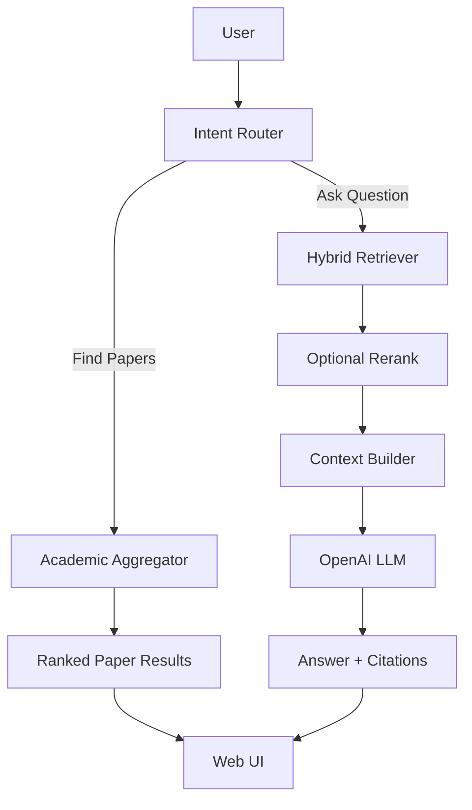
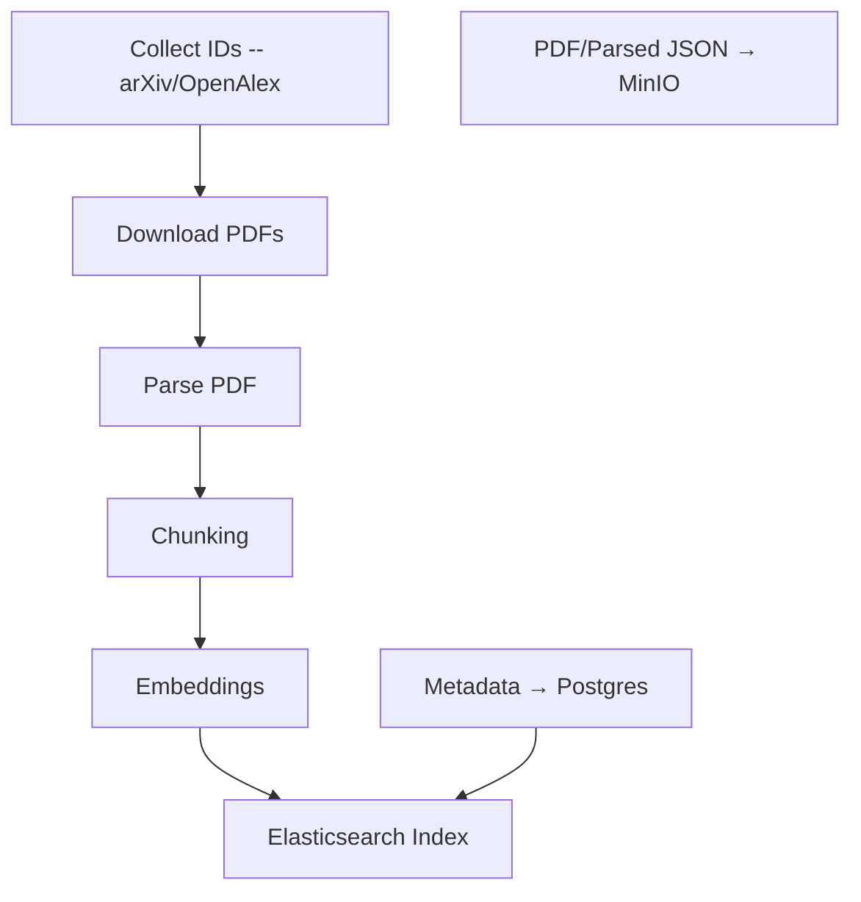

# Workflow Diagrams

## High-level

```mermaid
flowchart TD
  U[User] --> R[Intent Router]
  R -->|Find Papers| AGG[Academic Aggregator]
  AGG --> SR[Ranked Paper Results]
  R -->|Ask Question| RET[Hybrid Retriever]
  RET --> RR[Optional Rerank]
  RR --> CT[Context Builder]
  CT --> GEN[OpenAI LLM]
  GEN --> ANS[Answer + Citations]
  SR --> UI[Web UI]
  ANS --> UI
```

## Ingestion & Indexing

```mermaid
flowchart TD
  Q[Collect IDs -- arXiv/OpenAlex] --> DL[Download PDFs]
  DL --> PRS[Parse PDF]
  PRS --> CH[Chunking]
  CH --> EMB[Embeddings]
  EMB --> ES[Elasticsearch Index]
  META[Metadata → Postgres] --> ES
  PDF[PDF/Parsed JSON → MinIO]
```
