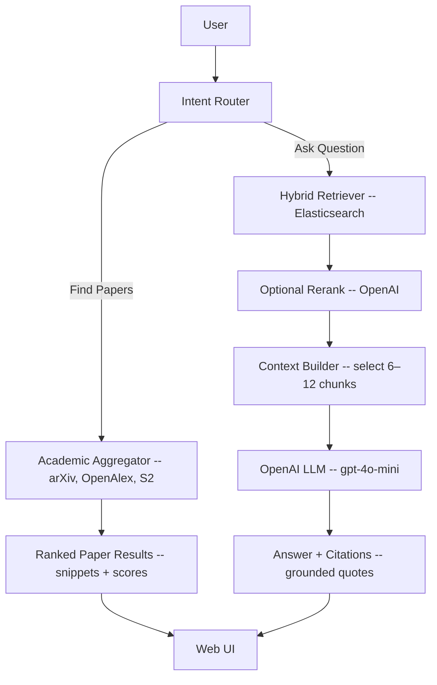

## Workflow Diagram (v1)

This document shows the end-to-end workflow for the academic chatbot with two capabilities: Find Papers and Ask Question (RAG). Stack: OpenAI API (embeddings + generation), Elasticsearch (BM25 + vector), Postgres (metadata), MinIO (PDFs/parsed JSON). No external Asta code.


```mermaid
flowchart TD Ingestion & Indexing
  Q[Collect IDs -- arXiv/OpenAlex] --> DL[Download PDFs]
  DL --> PRS[Parse pdf]
  PRS --> CH[Section-aware Chunking]
  CH --> EMB[OpenAI Embeddings -- text-embedding-3-large]
  EMB --> ES[Elasticsearch Index -- BM25]
  META[Metadata → Postgres] --> ES
  PDF[PDF/Parsed JSON → MinIO]
```
### Components
- Intent Router: decides between Find Papers and Ask Question.
- Academic Aggregator: queries arXiv/OpenAlex/Semantic Scholar, normalizes, dedupes, ranks.
- Hybrid Retriever: BM25 + dense-vector search in Elasticsearch with fusion.
- Reranker (optional): small OpenAI pass for improved ordering.
- Context Builder: assembles top passages with provenance.
- LLM: generates answers with citations and inline quotes.
- Ingestion: harvest, parse, chunk, embed, index; store metadata and artifacts.

### Notes
- Citations include `paper_id`, section/heading, and URL.
- Missing PDFs fall back to abstract-only (marked non-groundable).

